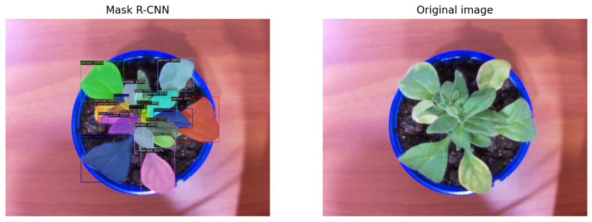

# 🌿 PhenoPi

**PhenoPi** is a prototype computer vision application designed to monitor and analyze plant development using AI-based image analysis. It provides tools and pipelines for plant phenotyping tasks such as leaf segmentation, instance detection, and growth tracking.

---

## 🚀 Features

* 🌱 **Plant Phenotyping:** Automated analysis of plant growth and development over time.
* 🧠 **AI-Powered:** Uses cutting-edge models like **Mask R-CNN**, **Mask2Former**, **YOLOv8**, and **SAM** (Segment Anything Model).
* 🔍 **Segmentation & Detection:** Multiple pipelines for leaf segmentation, instance recognition, and watershed analysis.
* 📊 **Data Preprocessing & Analysis:** Tools for preparing and interpreting image data.
* 🧪 **Notebook-Based:** Modular and easy-to-follow Jupyter notebooks for experimentation and customization.

---

## 🧑‍🔬 Notebooks Overview

| Notebook                                    | Description                            |
| ------------------------------------------- | -------------------------------------- |
| `Phenotyping Pipeline.ipynb`                | End-to-end pipeline for phenotyping    |
| `Data Preprocessing.ipynb`                  | Image resizing, cleaning, augmentation |
| `Leaf Instance Segmentation Pipeline.ipynb` | Traditional CV + DL segmentation       |
| `Leaf Only SAM.ipynb`                       | Uses Segment Anything Model            |
| `Mask-r-cnn.ipynb`                          | Object instance segmentation           |
| `Mask2Former.ipynb`                         | State-of-the-art image segmentation    |
| `Yolo8l_ghost.ipynb`                        | Fast object detection with YOLOv8      |
| `Watershed segmentation.ipynb`              | Classical segmentation technique       |

---

## 📸 Example Results

---

## 🧑‍💻 Authors

* **Madoxx21** – project development

---

## 📜 License

This project is for **research and educational purposes**.

---
